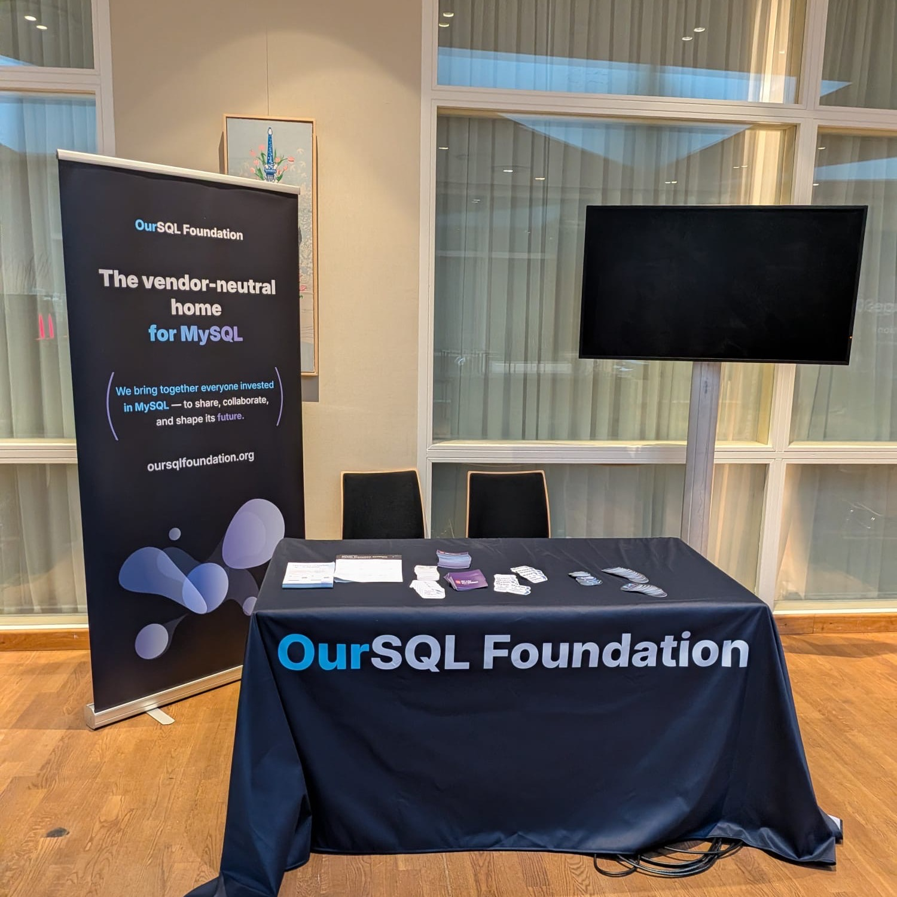
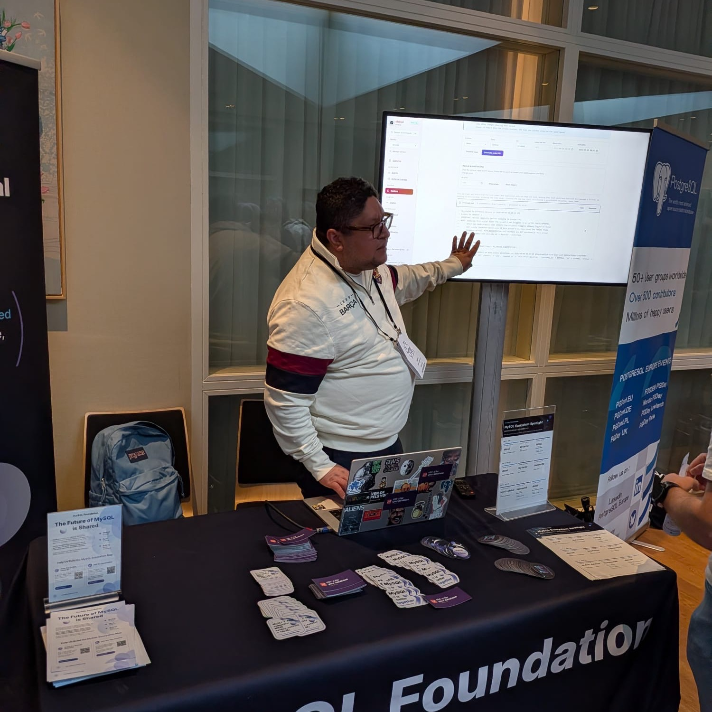
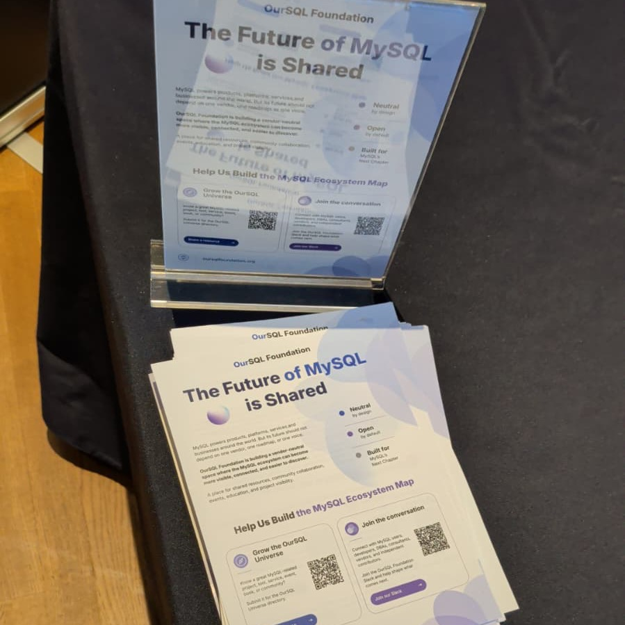

Quick test: name five tools in the MySQL ecosystem that are not MySQL itself. Most people stop at two.

That's the real problem. MySQL is everywhere, but a lot of what's built around it stays inside small circles. You know about it if you're in the right Slack channel. Nobody else does.

That's why, for our first conference booth, we did something a bit different: we gave it away.

<figure>
  
  <figcaption>The OurSQL Foundation booth at Percona Live Amsterdam 2026.</figcaption>
</figure>

At Percona Live Amsterdam (September 9–11), instead of a booth just about the Foundation, we split the table into time slots and handed it to smaller MySQL ecosystem projects. We called it the MySQL Ecosystem Spotlight. The idea was simple: let people show their own work, in front of an audience that might never find them otherwise.

Five projects took a slot over three days:

- **dbtrail** — time-travel for MySQL and PostgreSQL, so a bad UPDATE becomes a two-minute fix instead of a disaster. Founder: Daniel Guzmán Burgos.
- **MyVector** — a MySQL plugin for vector similarity search, built for semantic search and AI apps, no external service needed. Founder: Alkin Tezuysal.
- **AliSQL** — an open source MySQL branch from Alibaba Cloud with built-in analytics, vector indexes, and flashback. Founder: Zongzhi Chen.
- **MySQL Advisor** — paste your MySQL config, get a prioritized review, 148 checks, no database connection needed. Founder: Kedar Vaijanapurkar.
- **HammerDB** — open source benchmarking across MySQL and several other databases. Founder: Steve Shaw.

<figure>
  
  <figcaption>A live dbtrail demo at the shared booth.</figcaption>
</figure>

Visibility was the whole point, and the projects felt it too. Alkin told us MyVector has been around for years and is well known in the close MySQL circle but people outside it had never heard of it. He called the shared booth "the best way to unite the community and bring projects together." Steve Shaw had a similar moment with HammerDB: someone told him, "You don't realize how many people's lives you have changed." Foundations are key to open source, as he put it — and that's exactly the gap our OurSQL Universe, a growing map of the whole MySQL ecosystem, is meant to close. Amsterdam was a small preview of what that looks like in person.

The biggest thing we took away came from one question we kept hearing: people kept stopping to ask Vadim Tkachenko, the Foundation President, "How can I get involved? What do you want me to do?" That's a good problem — people are ready to contribute, they just don't know where to start. Making that clear is our job now.

So here it is, in plain terms: if you're building something around MySQL — a tool, a service, a community, anything — tell us about it. [Suggest a resource for the Universe](https://oursqlfoundation.org/resources/contribute/), or come say hi in our [Slack](https://join.slack.com/t/oursqlfoundation/shared_invite/zt-480k6h62a-t0HalCPwvXUC_lpd4aNylAl). That's how you get involved, starting today.

<figure>
  
  <figcaption>Flyers from the booth — same links, same invitation.</figcaption>
</figure>
